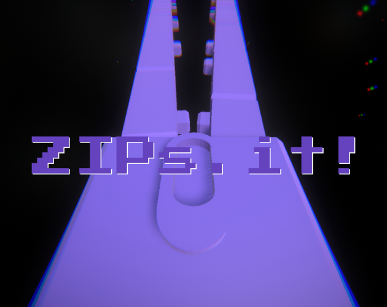
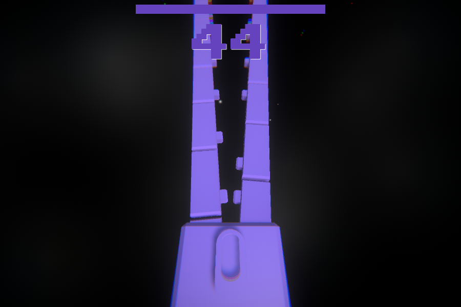
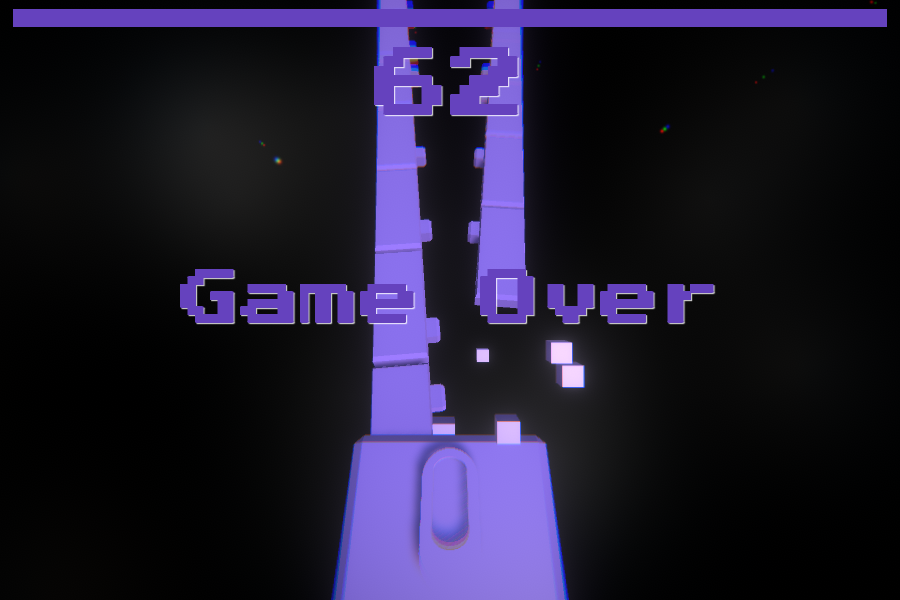
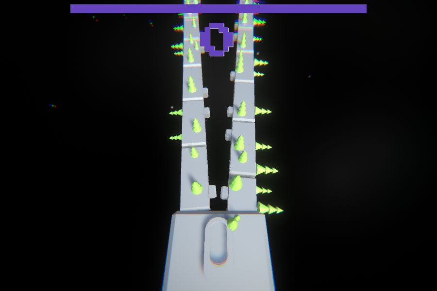
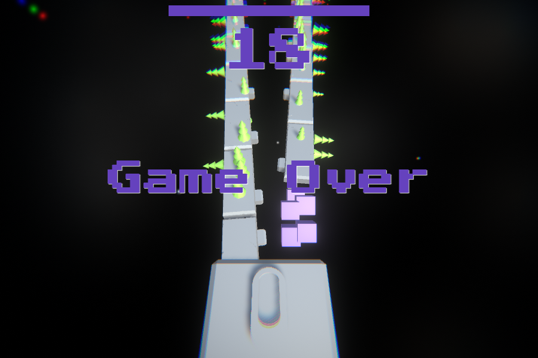
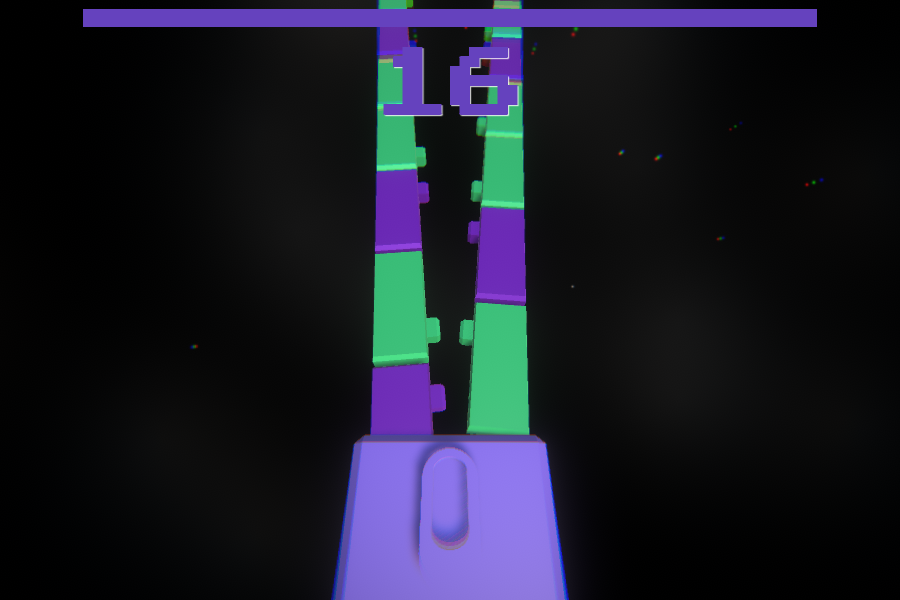
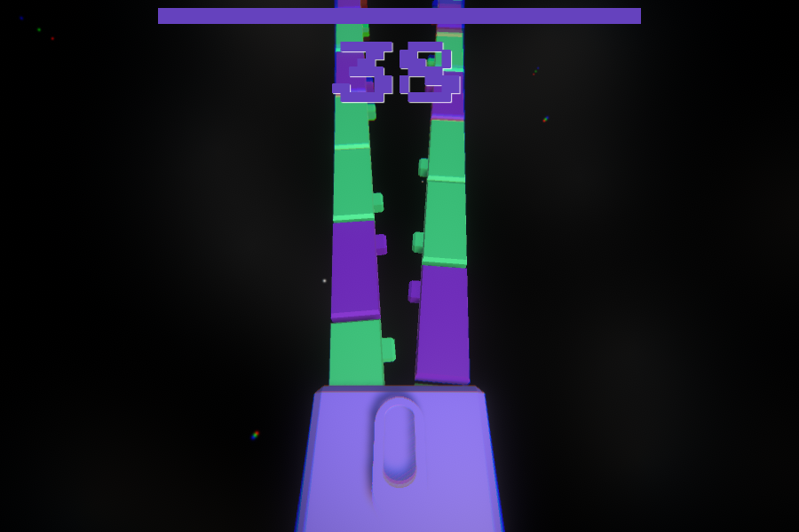

# ZIPs.it

A really simple game made for my dev colleagues & buddies from [twisto.cz](http://twisto.cz) and [zip.co](http://zip.co).

WebGL version is released on the [https://pixelook.itch.io/zipsit](https://pixelook.itch.io/zipsit) page.

## Used tools
[Blender](http://blender.org/) - for that super cool models  
[Bfxr](http://bfxr.net/), [ocenaudio](https://www.ocenaudio.com) - for SFX and sounds  
[ecrettmusic](http://ecrettmusic.com/) - for the music  
[Unity3d](https://unity.com) - hmm...

## Pictures

### Cover

### From game

